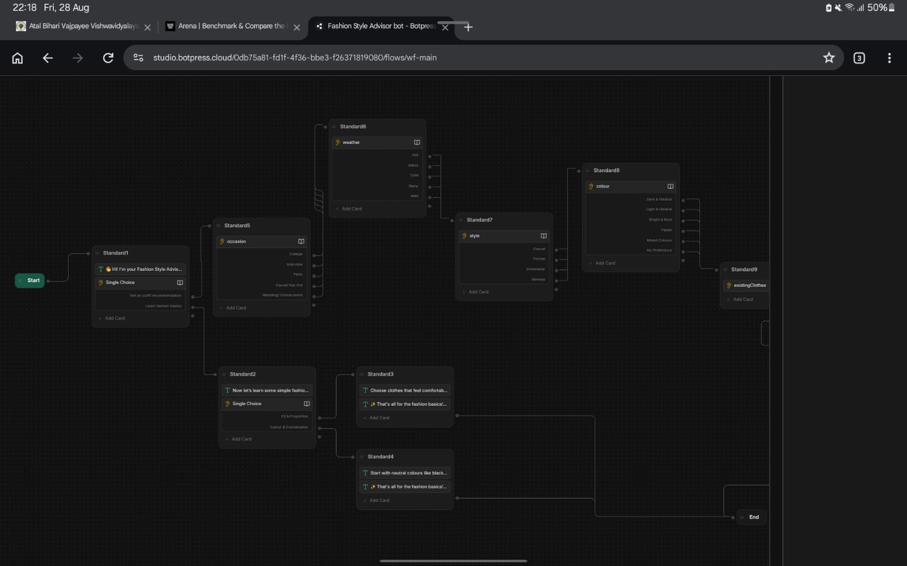
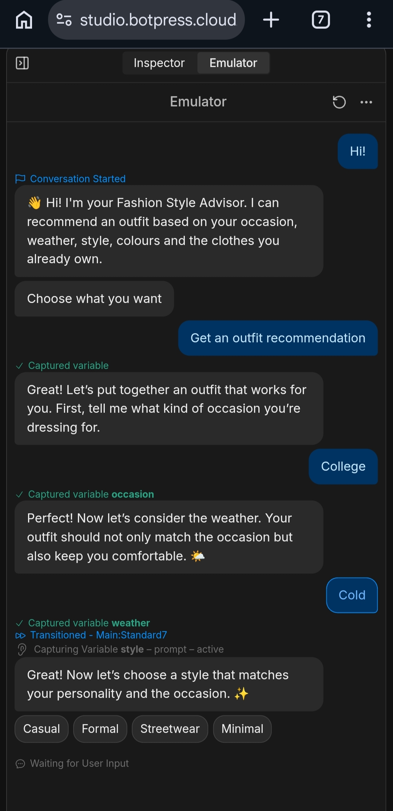
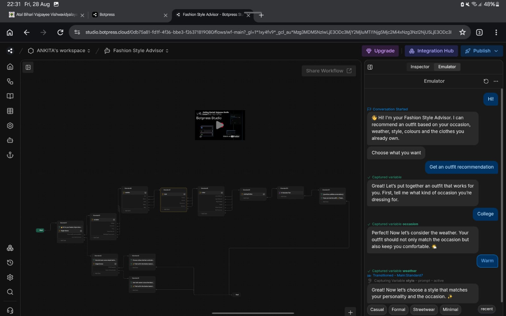

# AI-Fashion-Style-Advisor

An AI-powered chatbot built with Botpress that helps users create personalized outfit recommendations based on their preferences and situation.

✨ Features
🎯 Occasion-based outfit recommendations
🌤️ Weather-aware suggestions
👗 Style preference selection
🎨 Colour coordination
👚 Uses clothes the user already owns
🤖 AI-generated outfit recommendations
📚 Fashion basics
⚠️ Fallback handling for unsupported inputs

Workflow:
The chatbot collects:
Occasion → Weather → Style → Colour → Existing Clothes
It then uses these inputs to generate a personalized outfit recommendation.

## 📸 Screenshots

### Chatbot Flow

### User Interaction

### Outfit Recommendation

🛠️ Tech Stack
Botpress — chatbot development platform
Generative AI — recommendation generation
NLP / Conversational AI — understanding and handling user interactions

## 🔗 Live Chatbot

[Open the AI Fashion Style Advisor](https://cdn.botpress.cloud/webchat/v3.7/shareable.html?configUrl=https://files.bpcontent.cloud/2026/08/26/06/20260826062559-EP8FJT4L.json)

🚀 Future Improvements
Image-based wardrobe analysis
Weather API integration
More advanced personalization
Multilingual support
Mobile application
User profiles and saved outfits
